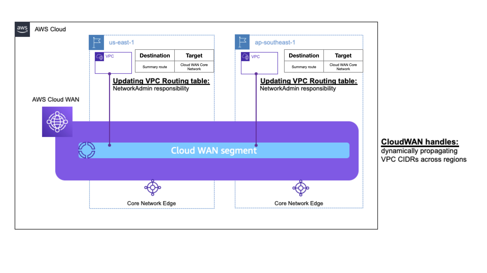

## AWS Cloud WAN and VPC IPAM integration for end-to-end automated routing

AWS Cloud WAN is a service that you can use to build, manage, and monitor a unified global network that connects resources running across your cloud and on-premises environments. Cloud WAN ensures dynamic route propagation across multiple regions. So for a sample deployment that spans across 2 regions: you'll create VPC attachments into Cloud WAN segments. Cloud WAN will ensure that each VPC's CIDR is dynamically learned across regions. To ensure that end to end connectivity works between your VPCs, you'll need to update the routing tables of the VPCs to provide network connectivity for workloads that reside within the VPCs. This is illustrated in Figure-1 below:



In this Guidance, we'll see how to automatically add (or delete) routes to VPC routing tables every time a VPC is attached into (or deleted from) a Cloud WAN segment. This will provide you with a fully automated end-to-end routing solution wherein workloads residing within VPCs have network connectivity to each other irrespective of the region where a VPC resides.

This solution is event driven, in that the route addition/deletion is triggered when a VPC is attached into (or detached from) a Cloud WAN segment.

### Prerequisites:

- Working knowledge of [AWS Cloud WAN] (https://docs.aws.amazon.com/network-manager/latest/cloudwan/what-is-cloudwan.html
)
- An [AWS account](https://signin.aws.amazon.com/signin?redirect_uri=https%3A%2F%2Fportal.aws.amazon.com%2Fbilling%2Fsignup%2Fresume&client_id=signup&code_challenge_method=SHA-256&code_challenge=0HQWGyGWYR-1yDUXafaSt2wlhL8OZGAHfZx3sDZN4mE) that you are able to use for testing, that is not used for production or other purposes. NOTE: You will be billed for any applicable AWS resources used if you complete this lab that are not covered in the [AWS Free Tier](https://aws.amazon.com/free/?all-free-tier.sort-by=item.additionalFields.SortRank&all-free-tier.sort-order=asc&awsf.Free%20Tier%20Types=*all&awsf.Free%20Tier%20Categories=*all).

- To deploy this solution you will have to have the [AWS CLI](https://docs.aws.amazon.com/cli/latest/userguide/getting-started-install.html) installed.

- If on Windows you will need a utility to execute Makefiles 

## How this solution works

Cloud WAN generates an event whenever a VPC attachment is created. The event has a JSON format and contains important information about the details of the VPC attachment. The structure of such an event is shown in Figure-3 below. Note that the "changeType" key has a value of "VPC_ATTACHMENT_CREATED"


Similarly, Cloud WAN generates an event every time a VPC is attachment is deleted. In such a case, the event's "changeType" key has a value of "VPC_ATTACHMENT_DELETED".

This solution uses Event Bridge and Lambda to detect the VPC_ATTACHMENT_CREATED and VPC_ATTACHMENT_DELETED events generated by Cloud WAN. Event Bridge then triggers a regional lambda function and passes the event's json object to the lambda function. The lambda function has the necessary logic that fetches the department specific CIDR from VPC IPAM. After getting the department CIDR, the Lambda function creates a Prefix List, and pushes a route into the VPC's routing table. The destination for this route is the Prefix List and the target for the route is the Cloud WAN core network.

The logical flow for this solution is shown in Figure-ABC below:


Whenever a VPC attachment is deleted, this solution detects that event and deletes the corresponding route from the VPC's routing table.

## Step by step instructions for a net new deployment

We have provided step by step instructions fro a net-new deployment at [this page](./samples/README.md). Please use these instructions in case you'd like to test this solution out in a sansbox environment.

## Instructions for an existing or customized deployment

This section details out the instructions that you'll need to execute to use this solution with an existing deployment, or in case you'd like to customize your Cloud WAN or IPAM deployment according to your use case.

After you complete these steps, this solution will automate the addition (or deletion) of a department-specific route into VPCs' routing table every time the VPC is attached into (or detached from) a Cloud WAN segment. This solution pulls the CIDR of the route from VPC IPAM Pools. This solution deploys regional lambda functions that include the necesssary logic for fetching department specific CIDR from VPC IPAM, and pushing the route into VPC's routing table.

### Step 1: Create your IPAM deployment

This solution uses VPC IPAM to store the CIDRs that are needed for populating VPC's routing tables. To use this solution for an exsiting or customized deployment, the first step is to create VPC IPAM Pools in us-east-1 Region. These pools should include the CIDR that you'd like to be pushed into VPCs' routing tables when you attach those VPCs into Cloud WAN segments. Check out [VPC IPAM documentation](https://docs.aws.amazon.com/vpc/latest/ipam/what-it-is-ipam.html) for details on how to create VPC IPAM pools.

Make a note of the VPC IPAM Pools' names. You'll use the same name as VPC attachments' tag while attaching VPCs into Cloud WAN. 

### Step 2: Create Cloud WAN deployment

Create your Cloud WAN deployment and the corresponding Cloud WAN policy based on your use-case. Check out [Cloud WAN documentation](https://docs.aws.amazon.com/network-manager/latest/cloudwan/what-is-cloudwan.html) for details.

### Step 3: Deploy Event Bridge and Lambda stacks

Clone this repo and navigate to the repo folder.

```bash
git clone https://github.com/aws-solutions-library-samples/guidance-for-end-to-end-fully-automated-global-network-on-aws.git && cd guidance-for-end-to-end-fully-automated-global-network-on-aws
```

Repeat steps 3.1 and 3.2 for each of your target regions. For example, if you have a Cloud WAN deployment in us-west-1 and us-east-1, you would repeat steps 3.1 and 3.2 once each for us-west-1 and us-east-1.

#### Step 3.1: Create regional stack in target region

Deploy the regional_lambda.yaml cloudformation template in the target region. This stack deploys two resources, a regional Event Bridge rule and a Lambda function that is triggered by the rule. The Lambda function includes the necessary code for fetching the correct CIDR from IPAM, adding and removing a prefix-list from the VPC's routing table.

After deploying the stack, make a note of the CloudFormation output named 'EventBridgeArn'.

#### Step-3.2: Deploy eventbridge_rule.yaml stack in us-west-2 region

Deploy the eventbridge_rule.yaml in us-west-2 Region. This stack creates the Event Bridge rule that traps on 'VPC attachment created' and 'VPC attachment deleted' events. Cloud WAN generates events in us-west-2 which will be sent to the event bridge rule that is created by the cloudformation stack.

### Step-4: Create VPCs

Create the VPCs that where you'll create your workloads. You can optionally use VPC IPAM to vend out CIDRs to these VPCs. Note that this solution will work even if you don't use VPC IPAM to vend out CIDRs to the VPCs.

### Step-5: Create VPC Attachments into Cloud WAN
 
At the time of creating VPC attachments into Cloud WAN, ensure that you provide a key:value tag pair on the attachment. The tag must be in the format of:
```bash
Department:<value>
```

The value of the tag must match the name of the corresponding VPC IPAM pool that you created in Step 1 above.

For example: if you created a VPC IPAM pool named 'finance', ensure that you tag the VPC attachment with a tag key-value pair of:
```bash
Department:finance
```

### Step-6: Verification

Navigate to VPC section on the console. Select the VPC that you connected into CloudWAN. Navigate to the VPC's main routing table. You should see a route that has a prefix list as the destination and Cloud WAN core network as the target. This is the route that this solution pushed into your VPC's routing table.

### Considerations
1. This solution is useful when your VPCs have multiple exit points. In the scenario drawing, each VPC has 2 exit points. One towards the Cloud WAN core-network, and second towards AWS Direct Connect gateway
2. In addition to the networking constructs, there's pricing associated with [EventBridge] (https://aws.amazon.com/eventbridge/pricing/) and with [Lambda] (https://aws.amazon.com/lambda/pricing/). Please check out service pricing pages for more details
3. This solution uses VPC IPAM to store CIDRs for storing department specific CIDRs. When enabled, VPC IPAM imports all IP addressing data from an existing deployment, and charges an hourly rate for every active IP address. Please check out [VPC IPAM pricing] (https://aws.amazon.com/vpc/pricing/) for more details

## References

- This solution was presented at re:Invent 2022 as a breakout session: [Demystifying VPC IP addressing & creating a complete routing solution](https://www.youtube.com/watch?v=rvJMCdjSZxU)
- [AWS Cloud WAN documentation.](https://docs.aws.amazon.com/network-manager/latest/cloudwan/what-is-cloudwan.html)
- [AWS Cloud WAN Workshop.](https://catalog.workshops.aws/cloudwan/en-US)
- Blog post: [Introducing AWS Cloud WAN (Preview).](https://aws.amazon.com/blogs/networking-and-content-delivery/introducing-aws-cloud-wan-preview/)
- Blog post: [AWS Cloud WAN and AWS Transit Gateway migration and interoperability patterns](https://aws.amazon.com/blogs/networking-and-content-delivery/aws-cloud-wan-and-aws-transit-gateway-migration-and-interoperability-patterns/)

Please reach out to aichadha@amazon.com or duanlig@amazon.com in case you have any questions about this repo.
