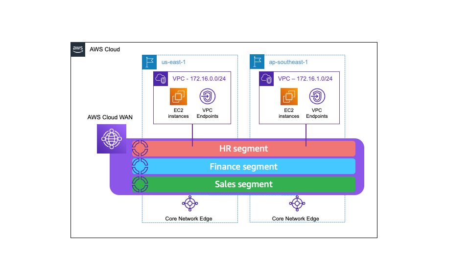

## Step by step instructions for a net new deployment

Note that the instructions provided in this section build out all the necessary Cloud WAN, IPAM and VPC constructs that are shown in Figure-2 below. Please navigate to "Instructions for an existing or customized deployment" section in case you'd like to use this solution for an existing deployment wherein you already have a Cloud WAN network or your own IP addressing scheme.

### Scenario

You have a global network, across 2 regions. Cloud WAN provides global network orchestration across these regions, and there are 3 Cloud WAN segments, one each for departments named Finance, Sales and HR. VPC IPAM stores the CIDRs assigned to each of the 3 departments. Note that this solution uses VPC IPAM purely to store the CIDRs of each department. You can optionally use VPC IPAM to provide CIDRs for your VPCs. The target state of the deployment is shown in Figure-2 below.



###  Step 1 - Deployment (Single command line deployment instructions)

This sample project is meant to be deployed to a single account and multiple regions. By default, AWS regions us-east-1, us-west-2 and ap-southeast-1 are in use.

#### Step 1.1 - Clone the repo and navigate to the correct directory

```bash
git clone https://github.com/aws-solutions-library-samples/guidance-for-end-to-end-fully-automated-global-network-on-aws.git && cd guidance-for-end-to-end-fully-automated-global-network-on-aws/samples
```

#### Step 1.2 - Deploy the CloudFormation stacks.

```bash
make deploy
```

>NOTE: This deployment will take greater than 15 minutes.

### Step 2 - Testing and validation

After the VPC has been attached to Cloud WAN give the solution about 5-10 minutes before the routing tables have been updated. 

1. In us-east-1 open the [EC2 console](https://us-east-1.console.aws.amazon.com/ec2/home?region=us-east-1#Instances:instanceState=running) and connect to the `cloud-wan-demo-instance` ec2 instance with SSM. 
2. In ap-southeast-1 open the [EC2 console](https://ap-southeast-1.console.aws.amazon.com/ec2/home?region=ap-southeast-1#Instances:instanceState=running) and copy the private ip of the instance. 
3. In the ec2 SSM terminal window type `ping ` and then paste the private ip address of the instance in ap-southeast-1.

You now have dynamic end-to-end routing between VPCs in AWS, even when your VPCs are deployed in different AWS Regions!

>For additional verification you can check the default routing tables in the hr vpcs in both regions. You will notice a prefix list that was added when your VPC was attached to Cloud WAN.  

### Step 3 - Clean up

Delete CloudFormation stacks. This will remove all the stacks. (cloud wan, ipam, regional infrastructure, eventbridge rules, and Cloud WAN VPC attachments). Note that this operation must be done from within the samples directory that you navigated to in Step 1.

```bash
make undeploy
```

>NOTE: Remember to do `make undeploy` when you are done with the lab and your tests, to avoid undesired charges.

### Optional - Detailed instructions (Deploy a single stack at a time for a net new deployment)

This section not needed if you deployed step 1. It is to deploy each stack individually. 

1. `make deploy-global-infra` - This will deploy Cloud WAN and IPAM in us-east-1. 
2. `make deploy-target-1` - This will deploy a VPC, private subnet, VPC endpoints for SSM, an EC2 instance, lambda function, eventbridge rule, and Cloud WAN attachment in us-east-1. 
3. `make deploy-target-2` - This will deploy a VPC, private subnet, VPC endpoints for SSM, an EC2 instance, lambda function, eventbridge rule, and Cloud WAN attachment in ap-southeast-1.